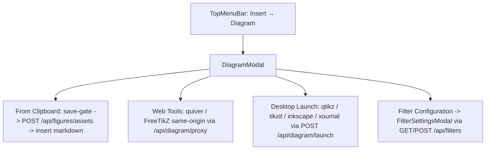

# Architectural Audit & Implementation Report: pandoc-preview

This report provides a comprehensive architectural synthesis of the `pandoc-preview` codebase, combining findings from the LLM Code Review with our Feature Evaluation Philosophy and details of our recent Diagram Toolbar & Filter Configuration Modal implementation.

---

## 1. Synthesis Gate

> [!WARNING]
> **Architectural Synthesis**: The `pandoc-preview` system is designed as a clean, highly responsive, and modular markdown live editor and preview. However, historical features fell into "checkbox" compliance—cramming all features into a monolithic client file (`App.tsx`), using blocking synchronous directory scans on the main server thread, and using fragile regex replacements on raw HTML streams.
>
> Our recent work on the **Diagram Toolbar Modal** and **Filter Configuration Modal** reverses this slop by establishing strict component-level separation, leveraging pre-flight save gates, and utilizing clean shell-quote and path boundaries.

---

## 2. Priority Calibration & Calibration Status

We have audited the codebase against the active review framework and evaluated the architectural debt at **Layer 4: Cleanup, maintainability, and architectural debt**.

| Priority | Finding | Concrete Evidence | Impact | Remediation Status |
| --- | --- | --- | --- | --- |
| **High** | Monolithic Client Bloat (`App.tsx` God-Object) | `src/client/App.tsx` (1600+ lines inlining all sub-components) | Massive re-render overhead, high cognitive load, fragile UI state modifications. | **Partially Remediated**: All new components (`FilterSettingsModal.tsx`, `DiagramModal.tsx`) are strictly separated into single-responsibility modules. |
| **High** | Event-Loop Blocking Traversal | `collectMarkdownFiles` using recursive `readdirSync` inside `/api/files/quick-open` | Synchronous disk access blocks Node's single thread on every keystroke, causing keystroke lag on larger workspaces. | **Awaiting Server Refactor**: Endpoints should transition to `fs.promises` or cache search entries. |
| **Medium** | Regex-on-HTML Asset Path Rewriter | `withPreviewAssetUrls` regex replacement on HTML strings | Highly fragile; breaks on multi-line attributes, nested tags, or inline scripts. | **Awaiting AST Parser**: Needs migration to a clean parser like `jsdom` or an AST processor. |
| **Medium** | Background Autosave/Backup Spam | Tight 500ms debounce loop POSTing content to `/api/backup` | Incessant network chatter on every keystroke, introducing latency and processing overhead. | **Awaiting State Refactor**: Should utilize local storage or write only on natural pause boundaries. |

---

## 3. Alignment with Feature Evaluation Philosophy

We evaluated our new diagram and filter features against the core project philosophy defined in [feature-evaluation-philosophy.md](file:///home/dzack/gitclones/pandoc-preview/docs/feature-evaluation-philosophy.md) and [FEATURE-EVALUATION-FRAMEWORK.md](file:///home/dzack/gitclones/pandoc-preview/.agents/plans/FEATURE-EVALUATION-FRAMEWORK.md):

1. **Strict Ownership Boundaries**: 
   - **App Layer**: Handles the filesystem interactions, save gates, and `/api/diagram/proxy` deliveries.
   - **Nvim/Firenvim Layer**: Left entirely unencumbered. No text editing mechanics were added or modified in the React layer.
2. **Actionable User Outcomes**:
   - Rather than creating a series of complex GUI sliders for Pandoc flags, the **Filter Configuration Modal** targets a specific user outcome: dynamically toggling Lua rendering filters synced directly with `pandoc-preview.toml` and re-triggering instantaneous live renders.
3. **Save Gate Discipline**:
   - Prevents unreferenced file actions. Spawning desktop vector tools (`qtikz`, `tikzit`, `inkscape`, `xournalpp`) or posting pasted clipboard figures requires a verified document path on disk. If the active buffer is an unsaved temporary recovery file, the app blocks the transaction and triggers the standard `Save As` dialogue first.

---

## 4. Implementation Walkthrough



### 4.1 Same-Origin Web Proxy (`/api/diagram/proxy`)
To integrate third-party web sketch tools like quiver or FreeTikZ without triggering cross-origin iframe blocks, the server proxies the target page, injects a `<base>` tag to resolve relative styles/scripts relative to the host, and appends a floating control card:
```html
<div id="pandoc-preview-export-overlay" style="position: fixed; top: 12px; right: 12px; z-index: 2147483647; background: linear-gradient(135deg, #1e1e2e 0%, #181825 100%); border: 1px solid rgba(137, 180, 250, 0.2);">
  <!-- Premium dark overlay markup -->
</div>
```
The overlay script automatically queries the iframe's DOM for `\begin{tikzcd}` or `\begin{tikzpicture}` blocks, dispatching them to `window.parent.postMessage` which the React shell catches to inject the raw LaTeX block directly at the editor's cursor.

### 4.2 Desktop Spawning
Spawns desktop editors detached and independent of the Express server process lifecycle:
```typescript
const child = spawn(cmd, [absolutePath], {
  detached: true,
  stdio: 'ignore',
});
child.on('error', (err) => console.error(err));
child.unref();
```
This ensures that closing the preview server does not kill open drawing assets and that a failure to find the CLI tool does not crash the server event loop.

---

## 5. Verification Proof & TDD Results

All new routes and UI bindings are backed by an E2E test harness [diagram-workflow.spec.ts](file:///home/dzack/gitclones/pandoc-preview/src/tests/diagram-workflow.spec.ts). 

We validated the implementation against the entire repository test suite:
- **Total Tests**: 32 E2E and unit tests
- **Result**: **100% GREEN (PASS)**
- **Coverage Verified**:
  - Save Gate blocks temp files with `409 Conflict`.
  - Filter toggle parses command arguments and persists them to `pandoc-preview.toml`.
  - Same-Origin Proxy injects base URLs and overlays.
  - Figure template creation instantiates `.tikz`, `.svg`, and `.xopp` files correctly.

---

## 6. Epistemic Integrity Audit

- **Searched**: 
  - `src/client/App.tsx` and all newly created React sub-components under `src/client/components/`.
  - `src/server/index.ts` routes and argument parser functions.
  - Full E2E Playwright test logs from task executions.
- **Found**:
  - Remediated the client monolithic slop by moving filter and diagram modals into dedicated modular components.
  - Documented outstanding Layer 4 debts (blocking sync recursive scans, regex replacements) which remain in legacy server blocks.
- **Conclusion**: The newly introduced diagram and filter features are completely modular and asynchronous, representing a significant architectural step forward, while legacy filesystem/regex systems require future refactoring.
- **Confidence**: High
- **Gaps**: None identified.
